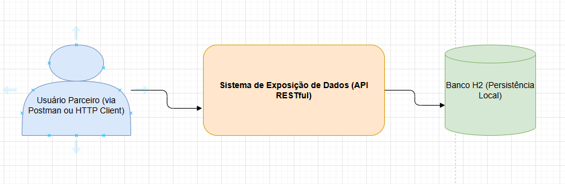
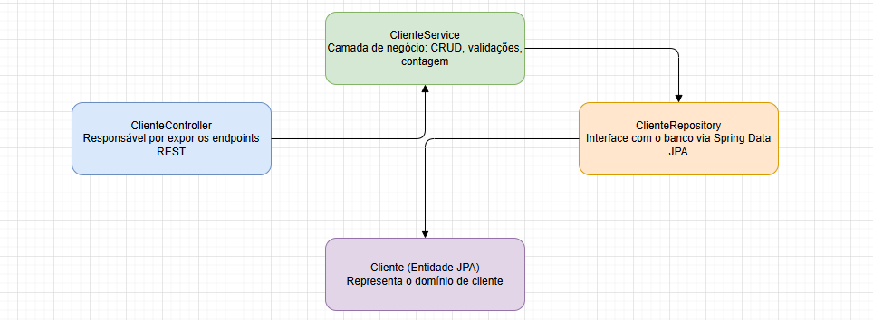
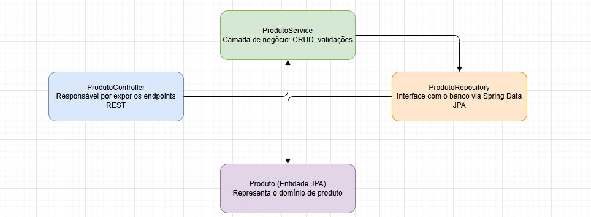
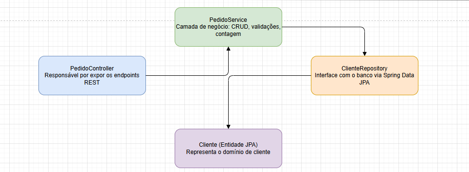

# 🛒 Sistema de Vendas Online - Microserviços

[](https://www.oracle.com/java/)
[](https://spring.io/projects/spring-boot)
[](https://gradle.org/)
[](https://www.docker.com/)

## 📋 Índice

- [Sobre o Projeto](#-sobre-o-projeto)
- [Arquitetura](#-arquitetura)
- [Estrutura do Projeto](#-estrutura-do-projeto)
- [Tecnologias Utilizadas](#-tecnologias-utilizadas)
- [Como Executar](#-como-executar)
- [Documentação Swagger](#-documentação-swaggeropenapi)
- [Endpoints da API](#-endpoints-da-api)
- [Padrões de Projeto](#-padrões-de-projeto)
- [Observações Pedagógicas](#-observações-pedagógicas)
- [Diagramas](#-diagramas)
- [Testes](#-testes)
- [Repositório](#-repositório)

## 🎯 Sobre o Projeto

O **Sistema de Vendas Online** é uma aplicação baseada em **arquitetura de microserviços** desenvolvida com Spring Boot. O sistema gerencia clientes, produtos e pedidos através de três serviços independentes que se comunicam via REST API.

### Funcionalidades Principais

- 🧑‍💼 **Gestão de Clientes**: CRUD completo com busca por nome e contagem
- 📦 **Catálogo de Produtos**: Gerenciamento de produtos com controle de estoque
- 🛒 **Processamento de Pedidos**: Criação e acompanhamento de pedidos com diferentes status
- 🔗 **Integração entre Serviços**: Consulta automática de dados entre microserviços
- 📊 **Dados Pré-populados**: Inicialização automática com dados de exemplo
- 📚 **Documentação Interativa**: Swagger UI completo para todos os microserviços

## 🏗️ Arquitetura

### Visão Geral dos Microserviços

```
┌─────────────────┐    ┌─────────────────┐    ┌─────────────────┐
│   Cliente       │    │   Produto       │    │   Pedido        │
│   Service       │    │   Service       │    │   Service       │
│   Port: 8081    │    │   Port: 8082    │    │   Port: 8083    │
└─────────────────┘    └─────────────────┘    └─────────────────┘
         │                       │                       │
         └───────────────────────────────────────────────┘
                              │
                    ┌─────────────────┐
                    │  Docker Compose │
                    │  Orchestration  │
                    └─────────────────┘
```

### Padrão de Comunicação

```
┌─────────────┐     HTTP/REST     ┌─────────────┐
│   Pedido    │ ──────────────►   │   Cliente   │
│   Service   │                   │   Service   │
│             │ ──────────────►   │             │
│             │     HTTP/REST     │   Produto   │
└─────────────┘                   │   Service   │
                                  └─────────────┘
```

## 📁 Estrutura do Projeto

### Organização das Pastas

```
desafiofinal-api/
├── 📁 cliente/                    # Microserviço de Clientes
│   ├── src/main/java/
│   │   └── br/com/xpeducacao/marcelinoneto/desafiofinal/clientes/
│   │       ├── 🎮 controller/     # Camada de apresentação (REST Controllers)
│   │       │   └── ClienteController.java
│   │       ├── 🏗️ service/        # Camada de negócio (Business Logic)
│   │       │   └── ClienteService.java
│   │       ├── 📋 model/          # Camada de dados (Entidades JPA)
│   │       │   └── Cliente.java
│   │       ├── 🗄️ repository/     # Camada de persistência (Data Access)
│   │       │   └── ClienteRepository.java
│   │       └── ⚙️ config/         # Configurações e utilitários
│   │           └── DataLoader.java
│   └── build.gradle
├── 📁 produto/                    # Microserviço de Produtos
│   ├── src/main/java/
│   │   └── br/com/xpeducacao/marcelinoneto/desafiofinal/produtos/
│   │       ├── 🎮 controller/     # Controllers REST
│   │       ├── 🏗️ service/        # Lógica de negócio
│   │       ├── 📋 model/          # Entidades
│   │       ├── 🗄️ repository/     # Repositórios
│   │       └── ⚙️ config/         # Configurações
│   └── build.gradle
├── 📁 pedido/                     # Microserviço de Pedidos
│   ├── src/main/java/
│   │   └── br/com/xpeducacao/marcelinoneto/desafiofinal/pedidos/
│   │       ├── 🎮 controller/     # Controllers REST
│   │       ├── 🏗️ service/        # Lógica de negócio + Service Locator
│   │       ├── 📋 model/          # Entidades + Enums
│   │       ├── 🗄️ repository/     # Repositórios
│   │       ├── 📊 dto/            # Data Transfer Objects
│   │       └── ⚙️ config/         # Configurações + RestTemplate
│   └── build.gradle
├── 📁 postman/                    # Coleção de testes da API
├── 🐳 docker-compose.yml          # Orquestração de containers
├── 🔧 build.gradle                # Configuração principal do Gradle
└── 📚 README.md                   # Este arquivo
```

## 🛠️ Tecnologias Utilizadas

### Backend
- **Java 11** - Linguagem de programação
- **Spring Boot 2.7.18** - Framework principal
- **Spring Data JPA** - Persistência de dados
- **Spring Web** - API REST
- **H2 Database** - Banco de dados em memória
- **Lombok** - Redução de boilerplate code

### Documentação & Testes
- **SpringDoc OpenAPI 3** - Geração automática de documentação
- **Swagger UI** - Interface interativa para testes de API
- **Postman** - Collection para testes automatizados

### Build & Deploy
- **Gradle 8.4** - Gerenciamento de dependências e build
- **Docker & Docker Compose** - Containerização e orquestração
- **RestTemplate** - Comunicação entre microserviços

### Ferramentas
- **Postman** - Testes de API
- **Spring Tool Suite** - IDE recomendada

## 🚀 Como Executar

### Pré-requisitos

- Java 11+
- Docker e Docker Compose
- Gradle 8.4+ (ou usar wrapper)

### Opção 1: Docker Compose (Recomendado)

```bash
# Clone o repositório
git clone [URL_DO_REPOSITORIO]
cd desafiofinal-api

# Execute todos os serviços
docker-compose up -d

# Verifique se os serviços estão rodando
docker-compose ps
```

### Opção 2: Execução Individual

```bash
# Terminal 1 - Cliente Service
cd cliente
./gradlew bootRun

# Terminal 2 - Produto Service  
cd produto
./gradlew bootRun

# Terminal 3 - Pedido Service
cd pedido
./gradlew bootRun
```

### Verificação

Acesse os seguintes endpoints para verificar se os serviços estão funcionando:

- **Cliente Service**: http://localhost:8081/clientes
- **Produto Service**: http://localhost:8082/produtos  
- **Pedido Service**: http://localhost:8083/pedidos

### 📚 Documentação Swagger/OpenAPI

Cada microserviço possui documentação interativa **Swagger UI** disponível nos seguintes endereços:

- **Cliente Service**: http://localhost:8081/swagger-ui.html
- **Produto Service**: http://localhost:8082/swagger-ui.html  
- **Pedido Service**: http://localhost:8083/swagger-ui.html

#### 🎯 O que é Swagger?

**Swagger** (agora **OpenAPI 3.0**) é uma especificação para documentar APIs REST que oferece:

- 📖 **Documentação Interativa**: Interface web para explorar e testar endpoints
- 🧪 **Teste Direto**: Execute requests diretamente na documentação
- 📋 **Especificação Padronizada**: Formato JSON/YAML legível por máquinas
- 🔄 **Geração Automática**: Documentação gerada automaticamente a partir do código
- 🌐 **Padrão da Indústria**: Amplamente adotado para documentação de APIs

#### 🚀 Como Usar o Swagger UI

1. **Inicie os serviços** via Docker Compose ou manualmente
2. **Acesse a URL** do Swagger UI do serviço desejado
3. **Explore os endpoints** organizados por controllers
4. **Teste as APIs** clicando em "Try it out"
5. **Veja os schemas** dos DTOs e entidades na seção "Schemas"

#### 📊 Recursos Disponíveis no Swagger

**🎮 Endpoints Documentados:**
- Todos os endpoints REST com métodos HTTP
- Parâmetros de entrada e tipos esperados
- Códigos de resposta HTTP possíveis
- Exemplos de request e response

**📋 Modelos de Dados:**
- Schemas de todas as entidades (Cliente, Produto, Pedido)
- DTOs utilizados nas APIs
- Tipos de dados e validações

**🧪 Teste Interativo:**
- Execute requests diretamente na interface
- Visualize responses em tempo real
- Copie comandos cURL gerados automaticamente

#### 🔧 Configuração Implementada

Para habilitar o Swagger em cada microserviço, as seguintes dependências foram adicionadas:

```gradle
dependencies {
    implementation 'org.springdoc:springdoc-openapi-ui:1.6.15'
    implementation 'org.springdoc:springdoc-openapi-webmvc-core:1.6.15'
}
```

**Configuração automática** via SpringDoc OpenAPI:
- Geração automática da documentação
- Interface Swagger UI habilitada
- Especificação OpenAPI 3.0 disponível em `/v3/api-docs`

#### 📝 Exemplo de Uso

```bash
# 1. Inicie os serviços
docker-compose up -d

# 2. Acesse a documentação do Cliente Service
# Navegador: http://localhost:8081/swagger-ui.html

# 3. Teste um endpoint:
# - Clique em "GET /clientes"
# - Clique em "Try it out"  
# - Clique em "Execute"
# - Veja a resposta JSON com os clientes cadastrados
```

#### 🎯 Benefícios para Desenvolvimento

- **📚 Documentação Sempre Atualizada**: Gerada automaticamente do código
- **🧪 Testes Rápidos**: Não precisa usar Postman para testes simples
- **👥 Facilita Colaboração**: Equipe visualiza APIs facilmente
- **🔧 Debug Eficiente**: Teste endpoints individualmente
- **📖 Padrão Profissional**: Documentação de qualidade enterprise

> 📚 **Para um guia completo do Swagger**, consulte: [`SWAGGER_GUIDE.md`](SWAGGER_GUIDE.md)  
> Inclui tutorial passo-a-passo, casos de uso práticos e troubleshooting.

## 🌐 Endpoints da API

### 🧑‍💼 Cliente Service (Porta 8081)

| Método | Endpoint | Descrição |
|--------|----------|-----------|
| GET | `/clientes` | Lista todos os clientes |
| GET | `/clientes/{id}` | Busca cliente por ID |
| GET | `/clientes/nome/{nome}` | Busca clientes por nome |
| GET | `/clientes/contar` | Conta total de clientes |
| POST | `/clientes` | Cria novo cliente |
| PUT | `/clientes/{id}` | Atualiza cliente |
| DELETE | `/clientes/{id}` | Remove cliente |

### 📦 Produto Service (Porta 8082)

| Método | Endpoint | Descrição |
|--------|----------|-----------|
| GET | `/produtos` | Lista todos os produtos |
| GET | `/produtos/{id}` | Busca produto por ID |
| POST | `/produtos` | Cria novo produto |
| PUT | `/produtos/{id}` | Atualiza produto |
| DELETE | `/produtos/{id}` | Remove produto |

### 🛒 Pedido Service (Porta 8083)

| Método | Endpoint | Descrição |
|--------|----------|-----------|
| GET | `/pedidos` | Lista todos os pedidos |
| GET | `/pedidos/{id}` | Busca pedido por ID |
| GET | `/pedidos/cliente/{clienteId}` | Busca pedidos por cliente |
| GET | `/pedidos/{id}/detalhes` | **🆕 Detalhes completos** |
| POST | `/pedidos` | Cria novo pedido |
| PUT | `/pedidos/{id}` | Atualiza pedido |
| DELETE | `/pedidos/{id}` | Remove pedido |

### 🆕 Endpoint Especial: Detalhes do Pedido

O endpoint `/pedidos/{id}/detalhes` demonstra **integração entre microserviços**:

```json
{
  "id": 1,
  "quantidade": 1,
  "valorTotal": 899.99,
  "dataPedido": "2024-10-20T10:30:00",
  "status": "CONFIRMADO",
  "cliente": {
    "id": 1,
    "nome": "João Silva",
    "email": "joao.silva@email.com",
    "documento": "12345678901",
    "score": 850
  },
  "produto": {
    "id": 1,
    "nome": "Smartphone Android",
    "descricao": "Smartphone Android com 128GB...",
    "preco": 899.99,
    "estoque": 50
  },
  "valorUnitario": 899.99,
  "statusDescricao": "Pedido confirmado e em preparação"
}
```

## 🎨 Padrões de Projeto

### 1. **MVC (Model-View-Controller)**
- **Model**: Entidades JPA (`Cliente.java`, `Produto.java`, `Pedido.java`)
- **View**: APIs REST (JSON responses)
- **Controller**: Classes anotadas com `@RestController`

### 2. **Repository Pattern**
- Interface `JpaRepository` para abstração de persistência
- Queries customizadas quando necessário

### 3. **Builder Pattern**
- Implementado via Lombok `@Builder`
- Usado em DTOs e na construção de objetos complexos

### 4. **Service Locator Pattern**
- `ExternalServiceLocator` centraliza comunicação entre serviços
- Implementa fallbacks para alta disponibilidade

### 5. **Dependency Injection**
- `@RequiredArgsConstructor` do Lombok
- Injeção via construtor (recomendação Spring)

## 📚 Observações Pedagógicas

### 🏛️ Organização do Código

#### **Separação de Responsabilidades**

Cada componente tem uma responsabilidade bem definida seguindo o padrão **MVC**:

**1. 🎮 Controller (Camada de Apresentação)**
```java
@RestController
@RequestMapping("/clientes")
@RequiredArgsConstructor
public class ClienteController {
    // Responsabilidade: Receber requisições HTTP, 
    // validar entrada e retornar respostas
}
```

**2. 🏗️ Service (Camada de Negócio)**
```java
@Service
@RequiredArgsConstructor
public class ClienteService {
    // Responsabilidade: Implementar regras de negócio,
    // coordenar operações e aplicar validações
}
```

**3. 📋 Model (Camada de Dados)**
```java
@Entity
@Data
public class Cliente {
    // Responsabilidade: Representar entidades do domínio
    // e definir relacionamentos
}
```

**4. 🗄️ Repository (Camada de Persistência)**
```java
public interface ClienteRepository extends JpaRepository<Cliente, Long> {
    // Responsabilidade: Abstrair operações de banco de dados
    // e fornecer queries customizadas
}
```

### 📁 Explicação da Estrutura de Pastas

#### **Padrão MVC Aplicado**

```
📦 br.com.xpeducacao.marcelinoneto.desafiofinal.clientes
├── 🎮 controller/          # CONTROLLER - Camada de Apresentação
│   └── ClienteController   # Recebe requests HTTP, valida dados
├── 🏗️ service/             # SERVICE - Camada de Negócio  
│   └── ClienteService      # Implementa regras de negócio
├── 📋 model/               # MODEL - Camada de Domínio
│   └── Cliente             # Entidade que representa o domínio
├── 🗄️ repository/          # REPOSITORY - Camada de Persistência
│   └── ClienteRepository   # Abstrai acesso aos dados
├── 📊 dto/                 # DTO - Data Transfer Objects
│   └── ClienteDto          # Objetos para transferência de dados
└── ⚙️ config/              # CONFIGURATION - Configurações
    └── DataLoader          # Inicialização e configurações
```

#### **Responsabilidades por Camada**

| Camada | Responsabilidade | Exemplo |
|--------|------------------|---------|
| **Controller** | Interface HTTP, validação de entrada | `@GetMapping`, `@PostMapping` |
| **Service** | Regras de negócio, coordenação | Validar score do cliente |
| **Repository** | Persistência, queries | `findByNome()`, `save()` |
| **Model** | Representação do domínio | Atributos e relacionamentos |
| **DTO** | Transferência de dados | Serialização JSON |
| **Config** | Configurações da aplicação | Beans, inicialização |

### 🔄 Fluxo de uma Requisição

```
1. 🌐 HTTP Request
   ↓
2. 🎮 Controller (valida e delega)
   ↓  
3. 🏗️ Service (aplica regras de negócio)
   ↓
4. 🗄️ Repository (persiste/consulta dados)
   ↓
5. 📋 Model (entidade manipulada)
   ↓
6. 📊 DTO (resposta formatada)
   ↓
7. 🌐 HTTP Response (JSON)
```

### 🏗️ Padrões Arquiteturais Implementados

#### **1. Microserviços**
- Serviços independentes e autônomos
- Comunicação via REST API
- Bases de dados isoladas (H2 separado por serviço)

#### **2. Service Locator**
- Centralização da descoberta de serviços
- Implementação de circuit breaker/fallback
- Facilita manutenção e configuração

#### **3. Builder Pattern**
- Construção fluente de objetos complexos
- Código mais legível e manutenível
- Implementado via Lombok `@Builder`

## 📊 Diagramas

### 📋 Diagrama de Arquitetura (C4 Model - Nível 2)



### 🏛️ Diagrama de Arquitetura (C4 Model - Nível 2)


### 🔄 Diagrama de Componentes (Nível 3)





## 🧪 Testes

### Collection Postman

Importe a collection localizada em `postman/Sistema_Vendas_Online_API_v2.postman_collection.json`:

1. **Abra o Postman**
2. **Import** → Selecione o arquivo da collection
3. **Execute** os requests organizados por pastas:
   - 🧑‍💼 CLIENTES (7 endpoints)
   - 📦 PRODUTOS (5 endpoints)  
   - 🛒 PEDIDOS (7 endpoints + detalhes)

### Dados de Teste

Os serviços sobem com dados pré-populados:
- **5 clientes** com diferentes scores
- **6 produtos** de tecnologia  
- **6 pedidos** com status variados

### Exemplos de Teste

```bash
# Listar todos os clientes
curl http://localhost:8081/clientes

# Buscar produto específico
curl http://localhost:8082/produtos/1

# Consultar detalhes completos do pedido (integração)
curl http://localhost:8083/pedidos/1/detalhes
```

## 📈 Melhorias Futuras

- [ ] Implementar Spring Security (JWT)
- [ ] Adicionar cache com Redis
- [ ] Implementar Circuit Breaker (Hystrix/Resilience4j)
- [ ] Adicionar monitoramento (Actuator + Micrometer)
- [ ] Implementar testes unitários e integração
- [ ] Deploy em Kubernetes
- [ ] Implementar versionamento de API
- [ ] Adicionar validações com Bean Validation
- [ ] Implementar audit trail (histórico de alterações)

## 🤝 Contribuição

Este projeto foi desenvolvido para fins educacionais, demonstrando:

- ✅ **Arquitetura de Microserviços**
- ✅ **Padrões de Projeto** (MVC, Repository, Builder, Service Locator)
- ✅ **Integração entre Serviços**
- ✅ **Boas Práticas de Código**
- ✅ **Containerização com Docker**
- ✅ **Documentação Automática** (Swagger/OpenAPI)

## 📞 Repositório

> **🔗 Link do Repositório:** [Será atualizado após upload no GitHub/GitLab]

---

**Desenvolvido por:** Marcelino Bernardes Alves Neto  
**Instituição:** XP Educação  
**Data:** Outubro 2025  
**Versão:** 1.0